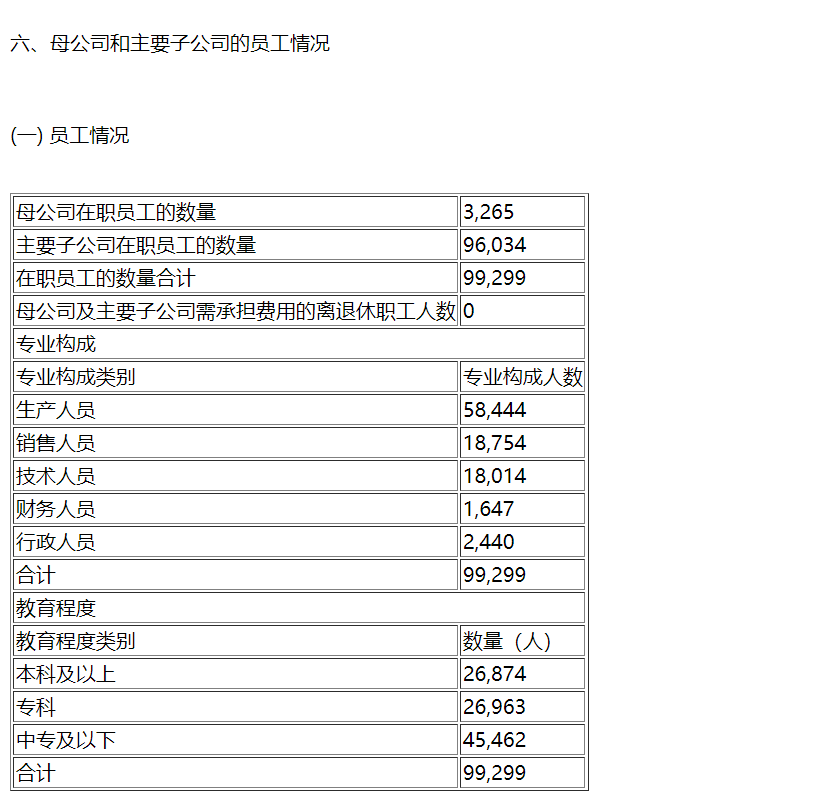

# docx-parser
A parser for docx that can extract paragraphs, tables and pictures (DOCX解析器)
java语言的针对DOCX的段落，表格和图片提取器，可以同时提取并生成html文件或json文件  

For table：  
   
For imgs：  
   

For usage, see SingleTest in the test folder.    
具体使用方式见test文件夹下的SingleTest  

